# Data Collection Pipeline — Cat Vegetation Toxin Database

How to systematically extract plant toxicity data from a NotebookLM notebook and push it into the database.

---

## High-Level Flow

```mermaid
flowchart TD
    A["📓 NotebookLM Notebook\n(source documents uploaded)"] --> B["🔍 Query Phase\nAsk structured questions\nper plant / per topic"]
    B --> C{"Answer complete?"}
    C -- No --> D["Ask follow-up\n(more detail / missing fields)"]
    D --> B
    C -- Yes --> E["📝 Parse & Normalize\nExtract structured fields\nfrom raw answer"]
    E --> F["💾 Insert into DB\nMap fields → tables"]
    F --> G{"More plants?"}
    G -- Yes --> B
    G -- No --> H["✅ Collection Complete"]
```



---

## Prerequisites

1. **NotebookLM notebook** — Upload your source documents (PDFs, web pages, articles on plant toxicity for cats) into a Google NotebookLM notebook.
2. **Authentication** — Run `python scripts/run.py auth_manager.py status` and authenticate if needed.
3. **Register the notebook** — Add it to the skill's library:
   ```bash
   python scripts/run.py notebook_manager.py add \
     --url "https://notebooklm.google.com/notebook/YOUR_ID" \
     --name "Cat Toxic Plants" \
     --description "Source documents on plants toxic to cats" \
     --topics "cats,toxicology,plants,veterinary"
   ```

---

## Query Strategy

The queries are organized into **rounds** that map directly to the database tables. Each round targets one plant at a time to keep answers focused and parseable.

### Round 0 — Discovery (run once)

> Get the full list of plants covered in your sources so you know what to iterate over.

```
"List every plant species mentioned in the sources that is toxic to cats.
 For each plant, provide the common name and scientific name.
 Format as a numbered list."
```

This gives you the **iteration list** for the remaining rounds.

---

### Round 1 — Plant basics → `plants`

```
"For the plant [COMMON_NAME] ([SCIENTIFIC_NAME]):
 1. What botanical family does it belong to?
 2. Give a brief description of the plant (appearance, habitat, where commonly found).
 Cite your sources."
```

**Maps to:** `plants.family`, `plants.description`

---

### Round 2 — Toxic parts → `toxic_parts` + `plant_toxic_parts`

```
"Which parts of [COMMON_NAME] are toxic to cats?
 (e.g. leaves, bulbs, flowers, pollen, stems, roots, seeds, bark, sap, fruit, entire plant)
 Cite your sources."
```

**Maps to:** `toxic_parts.name`, `plant_toxic_parts`

---

### Round 3 — Toxins → `toxins` + `plant_toxins`

```
"What are the toxic compounds or substances in [COMMON_NAME] that harm cats?
 For each toxin provide:
 1. Name of the compound
 2. Chemical formula (if available)
 3. Brief description of its mechanism of action in cats
 4. Any notes on concentration or potency
 Cite your sources."
```

**Maps to:** `toxins.name`, `toxins.chemical_formula`, `toxins.description`, `plant_toxins.concentration_notes`

---

### Round 4 — Symptoms → `symptoms` + `plant_symptoms`

```
"What symptoms does a cat show after ingesting or being exposed to [COMMON_NAME]?
 For each symptom provide:
 1. Symptom name
 2. Affected body system (e.g. gastrointestinal, renal, neurological, cardiac, dermal)
 3. Severity: mild, moderate, severe, or fatal
 4. Typical onset time (e.g. 'within 2 hours', '6–12 hours')
 5. Any additional clinical notes
 Cite your sources."
```

**Maps to:** `symptoms.name`, `symptoms.body_system`, `plant_symptoms.severity`, `plant_symptoms.onset`, `plant_symptoms.notes`

---

### Round 5 — Treatments → `treatments` + `plant_treatments`

```
"What are the recommended veterinary treatments if a cat ingests [COMMON_NAME]?
 List them in order of priority (most urgent first).
 For each treatment, provide:
 1. Treatment name
 2. Brief description of the procedure
 3. Any situation-specific notes
 Cite your sources."
```

**Maps to:** `treatments.name`, `treatments.description`, `plant_treatments.priority`, `plant_treatments.notes`

---

### Round 6 — Sources (automatic)

Every NotebookLM answer includes citations. Capture these as `sources` rows:
- **title** — the cited document name
- **url** — the source URL (if available)
- **accessed_at** — today's date

---

## Rate Limit Budget

NotebookLM allows **~50 queries/day** on a free account.

| Round | Queries per plant | Notes |
|---|---|---|
| 0 — Discovery | 1 (total) | Run once |
| 1 — Plant basics | 1 | |
| 2 — Toxic parts | 1 | |
| 3 — Toxins | 1 | May need 1 follow-up |
| 4 — Symptoms | 1 | May need 1 follow-up |
| 5 — Treatments | 1 | |
| **Total per plant** | **~5–7** | |

**Throughput:** ~7–9 plants per day (with follow-ups). Plan your collection batches accordingly.

---

## Data Normalization Rules

Before inserting into the database, normalize the raw answers:

| Field | Rule |
|---|---|
| `scientific_name` | Title-case, italicized binomial (e.g. *Lilium longiflorum*) |
| `toxic_parts.name` | Singular, capitalized (e.g. "Leaf" not "leaves") |
| `toxins.name` | Capitalize first letter (e.g. "Lycorine") |
| `symptoms.name` | Capitalize first letter (e.g. "Vomiting") |
| `severity` | Must be exactly one of: `mild`, `moderate`, `severe`, `fatal` |
| `plant_treatments.priority` | Integer starting from 1 (1 = most urgent) |
| Deduplication | Before inserting a `toxin`, `symptom`, `toxic_part`, or `treatment`, check if it already exists (by name) and reuse the existing `id` |

---

## Insertion Order

Respect foreign key constraints — insert in this order:

```
1. plants
2. toxic_parts        (deduplicate)
3. plant_toxic_parts
4. toxins              (deduplicate)
5. plant_toxins
6. symptoms            (deduplicate)
7. plant_symptoms
8. treatments          (deduplicate)
9. plant_treatments
10. sources
```

---

## Verification

Before inserting data into the database, run the verification workflow (`/verify-data`) to catch issues:

```bash
python3 verify_raw.py       # flags incomplete raw collection
python3 process_plants.py   # re-parse raw → processed
python3 verify_plants.py    # 3-tier audit: completeness, schema, cleanliness
```

The audit checks for:
- **Completeness** — all required fields and arrays are non-empty
- **Schema** — values match DB constraints (severity enum, field lengths, valid toxic parts)
- **Cleanliness** — no parsing artifacts, trailing source refs, header labels as values, or chatbot text

A plant should not be marked as "Done" in `collection_status.md` until it passes all checks.

---

## Example: Full Loop for One Plant

```
┌─ Query Round 0 ─────────────────────────────────────────┐
│  "List every toxic plant…"                              │
│  → Result: Easter Lily, Sago Palm, Azalea, …            │
└─────────────────────────────────────────────────────────┘
          │
          ▼  Pick: "Easter Lily"
┌─ Round 1 ───────────────────────────────────────────────┐
│  "For Easter Lily…family, description…"                 │
│  → INSERT INTO plants (…)                               │
└─────────────────────────────────────────────────────────┘
          │
          ▼
┌─ Round 2 ───────────────────────────────────────────────┐
│  "Which parts of Easter Lily are toxic?"                │
│  → INSERT INTO toxic_parts / plant_toxic_parts          │
└─────────────────────────────────────────────────────────┘
          │
          ▼
┌─ Rounds 3–5 (same pattern) ────────────────────────────┐
│  Toxins → Symptoms → Treatments                        │
└─────────────────────────────────────────────────────────┘
          │
          ▼
┌─ Round 6 ───────────────────────────────────────────────┐
│  Collect citations from all answers                     │
│  → INSERT INTO sources                                  │
└─────────────────────────────────────────────────────────┘
          │
          ▼  Next plant: "Sago Palm" → repeat
```

---

## Progress Tracking

Create a simple checklist (or a `collection_status.md`) to track which plants have been fully collected:

```markdown
| # | Plant | R1 | R2 | R3 | R4 | R5 | R6 | Done |
|---|-------|----|----|----|----|----|----|------|
| 1 | Easter Lily | ✅ | ✅ | ✅ | ✅ | ✅ | ✅ | ✅ |
| 2 | Sago Palm   | ✅ | ✅ | ⏳ |    |    |    |    |
| 3 | Azalea      |    |    |    |    |    |    |    |
```
