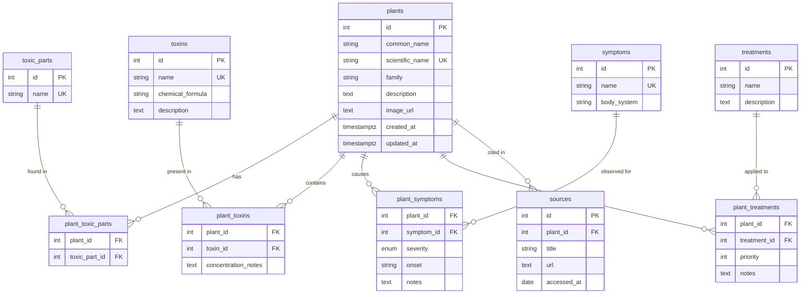

# Cat Vegetation Toxin Database — Schema Documentation

A relational database that catalogues **plants toxic to cats**, the chemical compounds responsible, clinical symptoms, severity levels, and veterinary treatment guidance.

---

## Entity-Relationship Diagram



---

## Tables

### 1. `plants`

The central entity — each row represents a single plant species known to be toxic to cats.

| Column | Type | Constraints | Description |
|---|---|---|---|
| `id` | `SERIAL` | `PRIMARY KEY` | Auto-incrementing identifier |
| `common_name` | `VARCHAR(150)` | `NOT NULL` | Common English name (e.g. "Easter Lily") |
| `scientific_name` | `VARCHAR(200)` | `NOT NULL`, `UNIQUE` | Botanical binomial (e.g. *Lilium longiflorum*) |
| `family` | `VARCHAR(100)` | — | Botanical family (e.g. "Liliaceae") |
| `description` | `TEXT` | — | General description of the plant |
| `image_url` | `TEXT` | — | URL to a reference photo |
| `created_at` | `TIMESTAMPTZ` | `DEFAULT now()` | Row creation timestamp |
| `updated_at` | `TIMESTAMPTZ` | `DEFAULT now()` | Auto-updated via trigger on row modification |

**Indexes:** `common_name`, `family`

---

### 2. `toxic_parts`

A lookup table listing the parts of a plant that can be dangerous (e.g. leaf, bulb, pollen, seed, flower, stem, root, bark, sap, fruit).

| Column | Type | Constraints | Description |
|---|---|---|---|
| `id` | `SERIAL` | `PRIMARY KEY` | Auto-incrementing identifier |
| `name` | `VARCHAR(50)` | `NOT NULL`, `UNIQUE` | Part name |

---

### 3. `plant_toxic_parts` *(junction)*

Links plants to their toxic parts. A plant may have multiple dangerous parts, and the same part type (e.g. "Leaf") applies to many plants.

| Column | Type | Constraints | Description |
|---|---|---|---|
| `plant_id` | `INT` | `FK → plants(id)`, `ON DELETE CASCADE` | The plant |
| `toxic_part_id` | `INT` | `FK → toxic_parts(id)`, `ON DELETE CASCADE` | The toxic part |

**Primary Key:** `(plant_id, toxic_part_id)`

---

### 4. `toxins`

Chemical compounds or substance classes responsible for toxicity.

| Column | Type | Constraints | Description |
|---|---|---|---|
| `id` | `SERIAL` | `PRIMARY KEY` | Auto-incrementing identifier |
| `name` | `VARCHAR(150)` | `NOT NULL`, `UNIQUE` | Compound name (e.g. "Lycorine") |
| `chemical_formula` | `VARCHAR(100)` | — | Optional chemical formula |
| `description` | `TEXT` | — | How the toxin affects feline physiology |

**Indexes:** `name`

---

### 5. `plant_toxins` *(junction)*

Associates plants with their toxins. The junction carries optional metadata about concentration.

| Column | Type | Constraints | Description |
|---|---|---|---|
| `plant_id` | `INT` | `FK → plants(id)`, `ON DELETE CASCADE` | The plant |
| `toxin_id` | `INT` | `FK → toxins(id)`, `ON DELETE CASCADE` | The toxin |
| `concentration_notes` | `TEXT` | — | Free-text notes on concentration or potency |

**Primary Key:** `(plant_id, toxin_id)`

---

### 6. `symptoms`

Clinical symptoms a cat may display after exposure.

| Column | Type | Constraints | Description |
|---|---|---|---|
| `id` | `SERIAL` | `PRIMARY KEY` | Auto-incrementing identifier |
| `name` | `VARCHAR(150)` | `NOT NULL`, `UNIQUE` | Symptom name (e.g. "Vomiting") |
| `body_system` | `VARCHAR(100)` | — | Affected body system (e.g. "Gastrointestinal", "Renal", "Neurological") |

**Indexes:** `body_system`

---

### 7. `plant_symptoms` *(junction)*

Links plants to symptoms, enriched with clinical metadata.

| Column | Type | Constraints | Description |
|---|---|---|---|
| `plant_id` | `INT` | `FK → plants(id)`, `ON DELETE CASCADE` | The plant |
| `symptom_id` | `INT` | `FK → symptoms(id)`, `ON DELETE CASCADE` | The symptom |
| `severity` | `severity_level` | `NOT NULL`, `DEFAULT 'moderate'` | One of: `mild`, `moderate`, `severe`, `fatal` |
| `onset` | `VARCHAR(100)` | — | Typical onset window (e.g. "Within 6–12 hours") |
| `notes` | `TEXT` | — | Additional clinical observations |

**Primary Key:** `(plant_id, symptom_id)`

---

### 8. `treatments`

Recommended veterinary interventions.

| Column | Type | Constraints | Description |
|---|---|---|---|
| `id` | `SERIAL` | `PRIMARY KEY` | Auto-incrementing identifier |
| `name` | `VARCHAR(200)` | `NOT NULL` | Treatment name (e.g. "IV fluid therapy") |
| `description` | `TEXT` | — | Detailed description of the treatment |

---

### 9. `plant_treatments` *(junction)*

Associates plants with recommended treatments, ordered by priority.

| Column | Type | Constraints | Description |
|---|---|---|---|
| `plant_id` | `INT` | `FK → plants(id)`, `ON DELETE CASCADE` | The plant |
| `treatment_id` | `INT` | `FK → treatments(id)`, `ON DELETE CASCADE` | The treatment |
| `priority` | `INT` | `NOT NULL`, `DEFAULT 0` | Lower value = higher priority |
| `notes` | `TEXT` | — | Situation-specific guidance |

**Primary Key:** `(plant_id, treatment_id)`

---

### 10. `sources`

References and provenance for the toxicity data.

| Column | Type | Constraints | Description |
|---|---|---|---|
| `id` | `SERIAL` | `PRIMARY KEY` | Auto-incrementing identifier |
| `plant_id` | `INT` | `FK → plants(id)`, `ON DELETE CASCADE` | The plant this source relates to |
| `title` | `VARCHAR(300)` | `NOT NULL` | Source title or citation |
| `url` | `TEXT` | — | URL to the source |
| `accessed_at` | `DATE` | — | Date the source was last accessed |

**Indexes:** `plant_id`

---

## Enum Reference

### `severity_level`

Used in the `plant_symptoms` table to classify how dangerous a symptom is.

| Value | Meaning |
|---|---|
| `mild` | Minor discomfort; usually self-resolving |
| `moderate` | Requires veterinary attention |
| `severe` | Potentially life-threatening without treatment |
| `fatal` | Can result in death even with treatment |

---

## Relationships Summary

```
plants ←→ toxic_parts     Many-to-Many   via plant_toxic_parts
plants ←→ toxins           Many-to-Many   via plant_toxins
plants ←→ symptoms         Many-to-Many   via plant_symptoms
plants ←→ treatments       Many-to-Many   via plant_treatments
plants  →  sources         One-to-Many
```

---

## Example Queries

### Find all symptoms for a plant

```sql
SELECT p.common_name,
       s.name        AS symptom,
       s.body_system,
       ps.severity,
       ps.onset
  FROM plants p
  JOIN plant_symptoms ps ON ps.plant_id = p.id
  JOIN symptoms s        ON s.id = ps.symptom_id
 WHERE p.scientific_name = 'Lilium longiflorum';
```

### List the most dangerous plants (any fatal symptom)

```sql
SELECT DISTINCT p.common_name, p.scientific_name
  FROM plants p
  JOIN plant_symptoms ps ON ps.plant_id = p.id
 WHERE ps.severity = 'fatal'
 ORDER BY p.common_name;
```

### Get treatments for a plant, ordered by priority

```sql
SELECT t.name        AS treatment,
       pt.priority,
       pt.notes
  FROM plants p
  JOIN plant_treatments pt ON pt.plant_id = p.id
  JOIN treatments t        ON t.id = pt.treatment_id
 WHERE p.common_name = 'Easter Lily'
 ORDER BY pt.priority;
```

### Search plants by toxic compound

```sql
SELECT p.common_name,
       p.scientific_name,
       tx.name             AS toxin,
       ptx.concentration_notes
  FROM plants p
  JOIN plant_toxins ptx ON ptx.plant_id = p.id
  JOIN toxins tx        ON tx.id = ptx.toxin_id
 WHERE tx.name ILIKE '%lycorine%';
```
